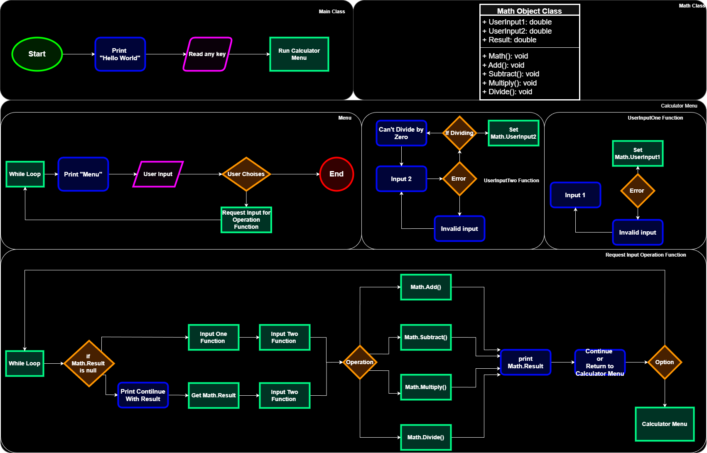

# A Calculator Application 
---

## The Purpose for this Project

- **Enhancing Programming Skills** – Developing a calculator helps improve understanding of C# syntax, .NET framework capabilities, and object-oriented programming principles.

- **Demonstrating UI/UX Design** – The project can serve as a practical example for designing an intuitive graphical user interface (GUI) even if in a terminal.

- **Showcasing Application Development** – The project highlights the integration of backend logic with a user-friendly interface, demonstrating best practices in software development.

## Planning Stage

- Tools and Setup for a C# project

- Define core functionality 

- Choose an input/output method 

- Implement error handling 

- Structure and Optimization 

## Tools and Setup

- **Development Environment**

	- The project will be built using C# within Visual Studio Code (VSCode), a lightweight yet powerful editor for .NET development.

		- VSCode Development Extensions:

			- To enhance productivity and streamline C# development, the following extensions will be installed:

			- C# Dev Kit 	

			- .NET Install Tool	

			- .NET Extension Pack – Offers additional tools and support for .NET development.

- **Version Control and Repository Management**

	- The project will be stored both locally and in a GitHub repository to ensure version control and collaboration.

		- Relevant VSCode extensions for GitHub integration:

			- Git Account – Allows seamless authentication and repository management.

			- Git Extension Pack

## Define core functionality
    
- **Support for Basic Arithmetic Operations**

    - The calculator will perform addition, subtraction, multiplication, and division using **double precision values**, ensuring accurate handling of floating-point calculations.

- **Persistent Answer Usage**

    - Users will have the option to utilize the **previously returned result** as an operand in subsequent calculations, streamlining multi-step computations.

## Choose an input/output method 

- **Input Handling**

    - The calculator will accept user input via a terminal-based interface, supporting the following data types:

    - **Double precision values** – Primary data type for calculations.

    - **Integer values** – Can be used for computations or selecting an operation.

    - **String character** – Used as a command to exit the application.

- **Operational Behavior**

    - **Integer inputs** will be processed either as numerical values for calculations or as operation choices selected by the user.

    - **String characters** will serve as an exit command to terminate the program.

    - **Double precision** values will be the primary type used for mathematical operations to ensure accurate computations.

- **User Interaction**

    - The program will **prompt users for input** through clear messages displayed in the terminal.

    - The output of each operation will be displayed as a **string message** in the terminal.

    - Output messages will indicate **results or warnings**, ensuring clarity in user feedback.

        - Example error message: "Error: Cannot divide by zero."

        - Example result message: "Result: 5.72"

## Implement error handling 

- **Error Handling**

    - **Improved User Feedback**

        - Most errors currently lack meaningful messages for the user, except for division by zero.

        - The error-handling system will be enhanced to provide clearer feedback, informing the user about input issues in a structured way.

    - **Handling Invalid or Breaking Inputs**

        - Critical input errors (such as unsupported or malformed values) will be **caught using try-catch blocks**, ensuring stability.

        - These errors will be displayed as a relevant message to the user, improving debugging and user experience.

    - **Non-Critical Input Handling**

        - Inputs that do not significantly affect operations (e.g., minor mistakes or misunderstandings) **will re-prompt the user instead of showing an error message**.

        - This approach keeps the user experience smooth while allowing corrections without interruption.

## Structure and Optimization

**Refined Structure**

- **Application Setup**

  - Initialize a simple `"Hello, World!"` message in the terminal.

  - Display a welcome message and prompt the user to input any key to proceed.

  - Transition to the Calculator`Menu` class.
 
**Calculator Menu Class**

-  Create a Calculator`Menu` class with a `MainMenu()` function.

- Prompt the user to select an operation or exit:

- Available Operations:

  - Addition

  - Subtraction

  - Multiplication

  - Division

  - Exit

  - Implement a switch statement for operation handling.

**Operation Handling**

- Prompt the user to enter two numeric inputs with proper validation.

- Define a `Math` class to store:

  - `dNum1` (double)

  - `dNum2` (double)

  - `dResult` (double)

- Set values within MainMenu() and call the appropriate operation methods:

  - `add()`, `subtract()`, `multiply()`, `divide()` (with division-by-zero check).

- Store the calculated result in the Math class.

**Loop Control**

- After displaying the result, prompt the user to:

- Return to the menu or continue.

- If continuing, ask whether they want to reuse the last result or input new values.

**Optimization & Object-Oriented Programming Compliance**

- **Encapsulation**: Separate calculator logic from the menu interface using a dedicated Calculator class.

- **Method Reusability**: Define modular functions for each mathematical operation.

- **Input Validation**: Ensure all user inputs are valid before performing calculations.

- **OOP Principles**: Follow an Object-Oriented approach by structuring functionality into logical classes.

 

